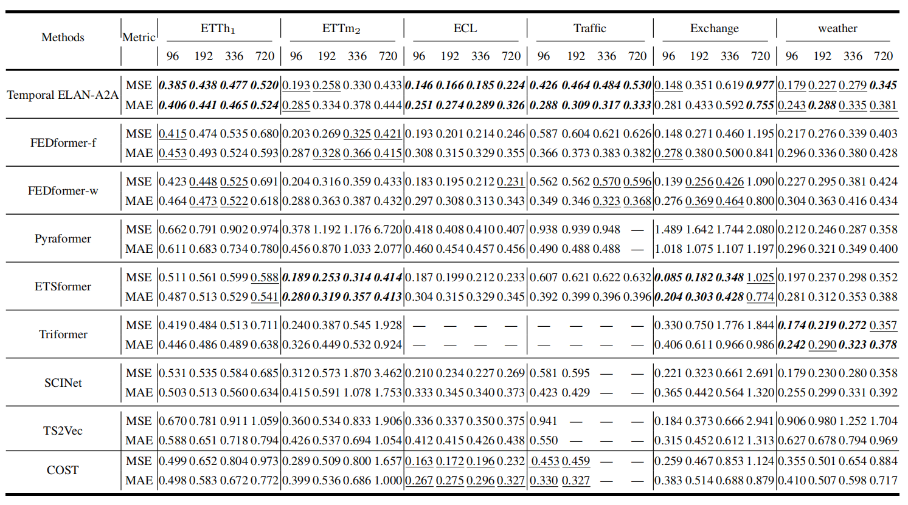

# Area2Area Forecasting: Looser Constraints, Better Predictions


This is the origin Pytorch implementation of Area2Area forecasting formula in the following paper: 
[Area2Area Forecasting: Looser Constraints, Better Predictions](Manuscript submitted to journal Information Sciences).


## Causal Sequence-wise Contrastive Learning
Positive sampling: We treat input sequences with/without data augmentation which span the same timestamps as
positive examples with each other. Meanwhile, other input
sequences are treated as negative examples of the current
selected input sequence, even if they only contain one different timestamp. (2) Negative sampling:
We introduce extra negative data augmentation into each input sequence where we randomly shuffle all elements of
input sequence and treat shuffled input sequences as negative examples of the current selected input sequence.
<p align="center">

<br><br>
<b>Figure 1.</b> An overview of the final contrastive loss. Each block denotes the representation of input sequence under a timespan
of a variable. Blocks with different colors refer to representations of different variables. Only input sequences with data augmentation (parallelogram with light color) which span the same timestamps of initial sequences are treated as their positive
examples (dotted lines) and other sequences are treated as their negative examples (solid lines).
</p>

## Area Loss
Area Loss (AL) replaces the certain truth of prediction sequence with an area surrounding it as shown in Figure 6. We choose a fixed upper bound as the maximum of truth area and a fixed lower bound as the minimum one. It means that values of prediction elements will be treated as truth if they are within aforementioned area

<p align="center">

<br><br>
<b>Figure 2.</b>  AL extends the truth (black line) to an area encompassed by two red dotted lines which separately refer to the
upper and lower bound.
</p>


## Temporal ELAN
we propose Temporal ELAN, a simple
and efficient feature extractor and use it as the backbone in the first stage. It is a CNN based network and has at least two merits compared with canonical Temporal Convolution
Network (TCN):
1. It abandons dilated convolution and utilizes only normal convolutions and pooling to extract universal feature
maps of input sequence.
2. It is derived from ELAN, a 2D CNN which has been proved to be powerful in Computer Vision (CV) tasks. Built upon ELAN, it not only acquires its merits, but also is capable of extracting hierarchical multi-scale feature maps of input sequence.

<p align="center">

<br><br>
<b>Figure 3.</b>  The architecture of Temporal ELAN. Each CPblock contains two convolutional layers and a maxpooling layer to shrink sequence length.
</p>

## Requirements

- Python 3.8
- matplotlib == 3.3.4
- numpy == 1.20.1
- pandas == 1.2.4
- scikit_learn == 0.24.1
- scipy == 1.9.0
- torch == 1.11.0

Dependencies can be installed using the following command:
```bash
pip install -r requirements.txt
```

## Data

ETT, ECL, Traffic, Exchange and weather datasets were acquired at: [datasets](https://drive.google.com/drive/folders/1ZOYpTUa82_jCcxIdTmyr0LXQfvaM9vIy?usp=sharing); 
WTH dataset was acquired at: [WTH](https://drive.google.com/drive/folders/1ohGYWWohJlOlb2gsGTeEq3Wii2egnEPR?usp=sharing).


## Usage
Commands for training and testing Temporal ELAN-A2A of all datasets are in `./scripts/A2A.sh`.

More parameter information please refer to `main.py`.

We provide a complete command for training and testing Temporal ELAN-A2A:

```
python -u main.py --model <model> --data <data> --root_path <root_path> --features <features> --label_len <label_len> --pred_list <pred_list> --d_model <d_model> --repr_dim <repr_dim> --kernel <kernel> --attn_nums <attn_nums> --pyramid <pyramid> --criterion <criterion> --dropout <dropout> --batch_size <batch_size>  --cost_batch_size <cost_batch_size> --order_num <order_num> --aug_num <aug_num> --jitter <jitter> --activation <activation> --cost_epochs <cost_epochs> --cost_grow_epochs <cost_grow_epochs> --train_epochs <train_epochs> --itr <itr>
```

Here we provide a more detailed and complete command description for training and testing the model:


| Parameter name | Description of parameter |
|:---:|:---:|
| model | The model of experiment. This can be set to `A2A` |
|      data      | The dataset name  |
|   root_path    | The root path of the data file  |
|   data_path    | The data file name  |
|    features    |The forecasting task. This can be set to `M`,`S` (M : multivariate forecasting, S : univariate forecasting |
|     target     |  Target feature in `S` task   |
|  checkpoints   | Location of model checkpoints |
| label_len |Input sequence length |
| pred_list | Group of prediction sequence length |
| enc_in | Input size |
| c_out | Output size  |
| d_model | Dimension of model |
|aug_num|The number of sequences with data augmentation, including initial sequences |
|order_num|The number of shuffled sequences|
|jitter|Supremum data augmentation amplification|
|aug|Augmentation method used in Area Loss. This can be set to `Scaling`,`Jittering` |
|instance_loss|Including instance loss during the first stage|
| dropout | Dropout  |
|kernel|The kernel size |
|criterion|Standardization|
| itr | Experiments times |
| activation |Activation function. This can be set to `Gelu`,`Tanh` |
| cost_epochs | Train epochs of the first stage |
| cost_grow_epochs | Train growing epochs of the first stage per experiment |
| train_epochs | Train epochs of the second stage |
| cost_batch_size | The batch size of training input data in the first stage |
| batch_size | The batch size of training input data in the second stage |
| patience | Early stopping patience  |
| learning_rate | Optimizer learning rate |
| pyramid |The number of Pyramid networks |
| attn_nums | The number of streams in the main Pyramid network |
|repr_dim|Dimension of representation|
| loss | Loss function |


## Results

The experiment parameters of each data set are formated in the `A2A.sh` files in the directory `./scripts/`. You can refer to these parameters for experiments, and you can also adjust the parameters to obtain better mse and mae results or draw better prediction figures.

<p align="center">

<br><br>
<b>Figure 4.</b> Multivariate forecasting results
</p>


## Contact
If you have any questions, feel free to contact Li Shen through Email (shenli@buaa.edu.cn) or Github issues. Pull requests are highly welcomed!
